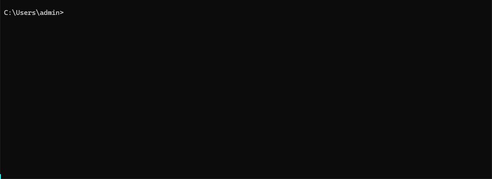

# google_photos_mobile_client

Google Photos client based on reverse engineered mobile API.

---

## CLI Demo



## Features

- Unlimited uploads in original quality (can be disabled).
- Use as a CLI tool or Python library.
- Skips files already present in your account.
- Upload individual files or entire directories, with optional recursive scanning.
- Album creation based on directory structure or custom album name.
- Real-time progress tracking.
- Configurable threads for faster uploads (default: 1).

## Installation

Run the command:

```bash
pip install https://github.com/xob0t/google_photos_mobile_client/archive/refs/heads/main.zip --force-reinstall
```

## Example Usage

> [!NOTE]
> If auth_data is omitted, `GP_AUTH_DATA` env variable will be used

### Python Client

```python
from gpmc import Client

path = "/path/to/media_file.jpg" # file or dir path
auth_data = "androidId=216e583113f43c75&app=com.google.android.app..."


client = Client(auth_data=auth_data)
output = client.upload(target=path, show_progress=True)

print(output)

# {"/absolute/path/to/media_file.jpg": "google_photos_media_key"}

```

### CLI

```bash
gpmc "/path/to/media_file.jpg" --progress --auth_data "androidId=216e583113f43c75&app=com.google.android.app..."
```

```text
usage: gpmc [-h] [--auth_data AUTH_DATA] [--album ALBUM] [--progress] [--recursive] [--threads THREADS] [--force-upload] [--delete-from-host] [--use-quota] [--saver] [--timeout TIMEOUT] [--log-level {DEBUG,INFO,WARNING,ERROR,CRITICAL}] [--filter FILTER] [--exclude] [--regex] [--ignore-case] [--match-path] path

Google Photos mobile client.

positional arguments:
  path                  Path to the file or directory to upload.

options:
  -h, --help            show this help message and exit
  --auth_data AUTH_DATA
                        Google auth data for authentication. If not provided, `GP_AUTH_DATA` env variable will be used.
  --album ALBUM         Add uploaded media to an album with given name. If set to 'AUTO', albums will be created based on the immediate parent directory of each file.
                        Example for using 'AUTO':
                        When uploading '/foo':
                        '/foo/image1.jpg' goes to 'foo'
                        '/foo/bar/image2.jpg' goes to 'bar'
                        '/foo/bar/foo/image3.jpg' goes to 'foo' (distinct from the first 'foo' album)
  --progress            Display upload progress.
  --recursive           Scan the directory recursively.
  --threads THREADS     Number of threads to run uploads with. Defaults to 1.
  --force-upload        Upload files regardless of their presence in Google Photos (determined by hash).
  --delete-from-host    Delete uploaded files from source path.
  --use-quota           Uploaded files will count against your Google Photos storage quota.
  --saver               Upload files in storage saver quality.
  --timeout TIMEOUT     Requests timeout, seconds. Defaults to 30.
  --log-level {DEBUG,INFO,WARNING,ERROR,CRITICAL}
                        Set the logging level (default: INFO)

File Filter Options:
  --filter FILTER       Filter expression.
  --exclude             Exclude files matching the filter.
  --regex               Use regex for filtering.
  --ignore-case         Perform case-insensitive matching.
  --match-path          Check for matches in the path, not just the filename.
```

## auth_data? Where Do I Get Mine?

Below is a step by step instruction on how to accuire your Google account's mobile auth data in a simplest way possible.  
You only need to do it once.

1. Get a rooted android device or an emulator. Recommended Android versions 9-13
2. Connect the device to your PC via ADB.
3. Install [HTTP Toolkit](https://httptoolkit.com)
4. In HTTP Toolkit, select Intercept - `Android Device via ADB`. Filter traffic with

    ```text
    contains(https://www.googleapis.com/auth/photos.native)
    ```

5. Open Google Photos app and login with your account.
6. There should be a single request found.  
   Copy request body as text.  
   
7. Now you've got yourself your auth_data! 🎉

## Troubleshooting

- __No Auth Request Intercepted__  
  1. Log out of your Goolge account.
  2. Log in again.
  3. Try `Android App via Frida` interception method in HTTP Toolkit.

- __403 Response Status__  
  - Try intercepting Google Photos ReVanced. Patch it yourself or use a patched apk [https://github.com/j-hc/revanced-magisk-module/releases](https://github.com/j-hc/revanced-magisk-module/releases)  
    It uses an alternative to google services, and the format of the auth request is a bit different.

## My Other Google Photos Scripts And Tools

- Web api python client: [https://github.com/xob0t/google_photos_web_client](https://github.com/xob0t/google_photos_web_client)
- Disguise any file as media for GP to accept and store it: [https://github.com/xob0t/gp-file-hide](https://github.com/xob0t/gp-file-hide)
- Manage library with bulk operations: [https://github.com/xob0t/Google-Photos-Toolkit](https://github.com/xob0t/Google-Photos-Toolkit)
