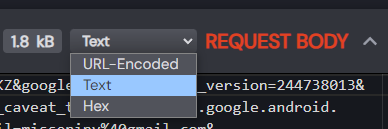

# gphotos_mobile_client

Very basic, reverse engineered, Google Photos mobile API client.  
Made for uploading files as Pixel XL without relying on a physical device/emulator.

---

## Set Up

Install with git and pip:

```bash
pip install git+https://github.com/xob0t/gphotos_mobile_client --force-reinstall
```

OR download as zip and intall with pip:

```bash
pip install gphotos_mobile_client.zip
```

## Example Usage

> [!NOTE]
> If auth_data is omitted, `GP_AUTH_DATA` env variable will be used

### Python Client

```python
from gpmc import Client

path = "/path/to/media_file.jpg" # file or dir path
auth_data = "androidId=216e583113f43c75&app=com.google.android.apps.photos&client_sig=34bb24c05e47e0aefa65a58a762171d9b613a680..."


client = Client(auth_data=auth_data)
media_key = client.upload(target=path, progress=True)
print(media_key)

```

### CLI

```bash
gp-upload "/path/to/media_file.jpg" --progress --auth_data "androidId=216e583113f43c75&app=com.google.android.apps.photos&client_sig=34bb24c05e47e0aefa65a58a762171d9b613a680..."
```

```text
usage: gp-upload [-h] [--auth_data AUTH_DATA] [--progress] [--recursive] [--threads THREADS] [--force-upload] [--timeout TIMEOUT] [--log-level {DEBUG,INFO,WARNING,ERROR,CRITICAL}] path

Google Photos mobile client.

positional arguments:
  path                  Path to the file or directory to upload.

options:
  -h, --help            show this help message and exit
  --auth_data AUTH_DATA
                        Google auth data for authentication. If not provided, `GP_AUTH_DATA` env variable will be used.
  --progress            Display upload progress.
  --recursive           Scan the directory recursively.
  --threads THREADS     Number of threads to run uploads with. Defaults to 1.
  --force-upload        Upload files regardless of their presence in Google Photos (determined by hash).
  --timeout TIMEOUT     Requests timeout, seconds. Defaults to 30.
  --log-level {DEBUG,INFO,WARNING,ERROR,CRITICAL}
                        Set the logging level (default: INFO)
```

## auth_data? Where Do I Get Mine?

Below is a step by step instruction on how to accuire your Google account's mobile auth data in a simplest way possible.  
You only need to do it once.

1. Get a rooted android device or an emulator. Recommended Android version >=9
2. Connect the device to your PC via ADB.
3. Install [HTTP Toolkit](https://httptoolkit.com)
4. In HTTP Toolkit, select Intercept - `Android Device via ADB`. Filter traffic with

    ```text
    contains(https://www.googleapis.com/auth/photos.native)
    ```

5. Open Google Photos app and login with your account.
6. There should be a single request found.  
   Copy request body as text.  
   
7. Now you've got yourself your auth_data! 🎉

## Troubleshooting

- __No Auth Request Intercepted__  
  1. Log out of your Goolge account.
  2. Log in again.
  3. Try `Android App via Frida` interception method in HTTP Toolkit.

- __403 Response Status__  
  - Try Google Photos ReVanced. Patch it yourself or use a patched apk [https://github.com/j-hc/revanced-magisk-module/releases](https://github.com/j-hc/revanced-magisk-module/releases)  
    It uses an alternative to google services, and the format of the auth request is a bit different.

## My Other Google Photos Scripts And Tools

- Disguse any file as media for GP to accept and store it: [https://github.com/xob0t/gp-file-hide](https://github.com/xob0t/gp-file-hide)
- Manage library with bulk operations: [https://github.com/xob0t/Google-Photos-Toolkit](https://github.com/xob0t/Google-Photos-Toolkit)
