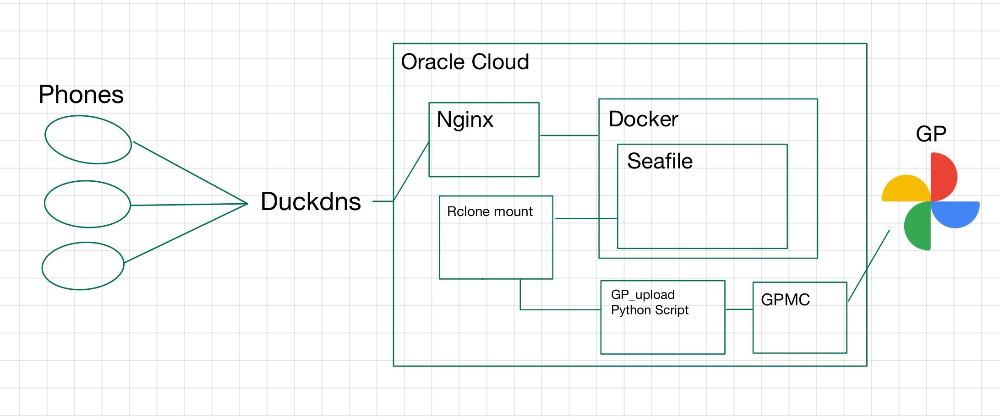

# Seafile + gpmc Auto-upload Setup Method



## Features
- Automatically upload photos and videos from iOS, Android, or other devices to Google Photos without limits.
- Easy file management.
- No command-line interaction required after setup.

---

## Setup Instructions

1. Install Seafile with Docker

Follow the official guide to install [Seafile with Docker](https://manual.seafile.com/11.0/docker/deploy_seafile_with_docker/).

2. Install Rclone

Install Rclone on your server, then configure it:

```bash
rclone config
```
- Follow the interactive prompts to configure Seafile.
  
3. Mount Seafile Drive

Create a local directory and mount your Seafile drive:

```bash
mkdir -p file
rclone mount seafile:/ /home/ubuntu/file/
```

4. Install gpmc

Run the command:

```bash
pip install https://github.com/xob0t/google_photos_mobile_client/archive/refs/heads/main.zip --force-reinstall
```
---

## Automated Upload Script

Create a new file named gp_upload.py and add the following content:

gp_upload.py

```python
import time
import os
import subprocess

# Path to monitor (Seafile Camera Uploads folder)
path = "/home/ubuntu/file/Picture/Camera Uploads/"

existing_files = set()

def check_for_new_files():
    global existing_files
    current_files = set(os.listdir(path))
    new_files = current_files - existing_files

    if new_files:
        for new_file in new_files:
            file_path = os.path.join(path, new_file)
            print(f"New file detected: {file_path}")

            # Replace 'androidId=...' with your actual Google Photos authentication details
            bash_command = f'gpmc "{file_path}" --progress --delete-from-host --auth_data "androidId=YOUR_ANDROID_ID"'

            try:
                subprocess.run(bash_command, shell=True, check=True)
            except subprocess.CalledProcessError as e:
                print(f"Upload error: {e}")

    existing_files = current_files

if __name__ == "__main__":
    print("Monitoring started...")
    try:
        while True:
            check_for_new_files()
            time.sleep(5)  # Check every 5 seconds
    except KeyboardInterrupt:
        print("Monitoring stopped by user.")
```

Important Notes
- Replace "androidId=YOUR_ANDROID_ID" with your actual Google Photos authentication data.
- Ensure gpmc is installed and configured correctly on your server.

## Run the script
Execute your script using:

```bash
python3 gp_upload.py
```
---

## Run Automatically (Optional)
To run your script on system startup, create a systemd service file by following these steps:

1. Open the Service File for Editing:
   
```bash
sudo nano /etc/systemd/system/gp_upload.service
```

Add the Following Contents:

```ini
[Unit]
Description=GP Upload Service
After=network.target

[Service]
ExecStart=/usr/bin/python3 /home/ubuntu/gp_upload.py
WorkingDirectory=/home/ubuntu
StandardOutput=journal
StandardError=journal
Restart=always
User=ubuntu
Group=ubuntu
Environment="PATH=/home/ubuntu/.local/bin:/usr/local/bin:/usr/bin:/bin"  # gpmc path

[Install]
WantedBy=multi-user.target
```

Reload systemd to Apply the New Service:

```bash
sudo systemctl daemon-reload
sudo systemctl enable gp_upload.service
sudo systemctl start gp_upload.service
```

## Rclone Mount Automatically (Optional)

To mount a drive using rclone at system startup, create a systemd service file by following these steps:

1. Open the Service File for Editing:
   
```bash
sudo nano /etc/systemd/system/rclone-seafile.mount.service
```

Add the Following Contents:

```ini
[Unit]
Description=Rclone Mount for Seafile
After=network-online.target
Wants=network-online.target

[Service]
Type=simple
ExecStart=/usr/bin/rclone mount seafile:/ /home/ubuntu/file/ --config=/home/ubuntu/.config/rclone/rclone.conf --allow-other --umask 002
ExecStop=/bin/fusermount -u /home/ubuntu/file
Restart=on-failure
User=ubuntu
Group=ubuntu

[Install]
WantedBy=default.target
```

Reload systemd to Apply the New Service:

```bash
sudo systemctl daemon-reload
sudo systemctl enable rclone-seafile.mount.service
sudo systemctl start rclone-seafile.mount.service
```


